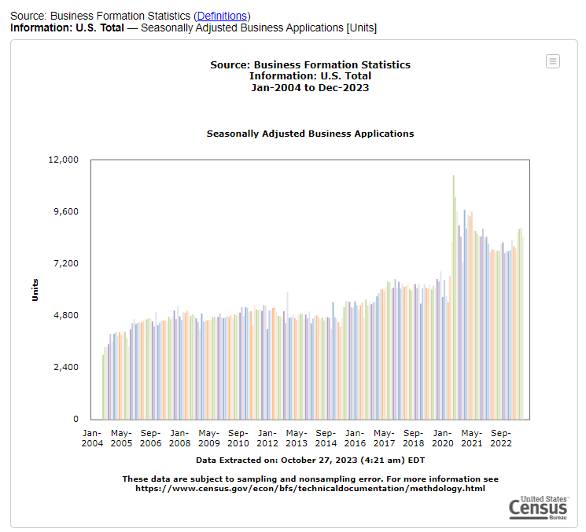
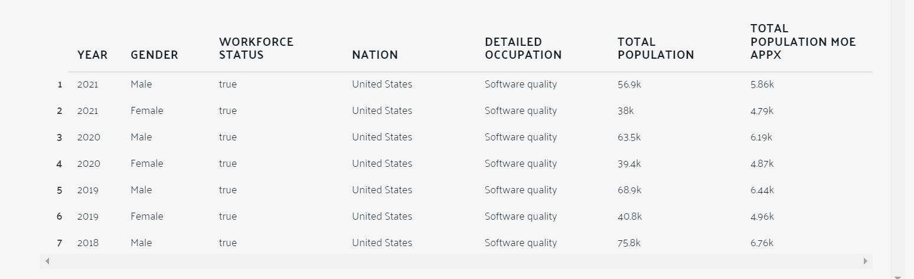
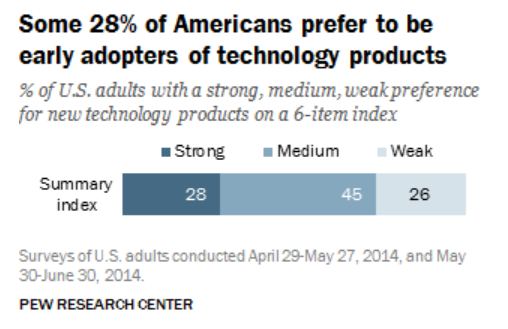

# Whitepaper

**Version**: 1.0.0

## Overview:

Crypto is not just a speculative instrument for traders. Not on our watch.

**We, at Hyperversal Blocks believe that the best way forward is to research, plan and execute new features and services
for the consumer.**

Our primary objective is simple: increase consumer adoption by focusing on the following critical areas:

- Practical services for the people
- Secure core technology
- Privacy for all
- Completely open-source

Yes, you heard that right. Privacy is at the core of our ecosystem. It is your right and no one can take it away from
you.

Hyperversal Blocks will never, ever, make a product for its user base that is not open-source.

We are going to fight your battle for you, and for us, and for our and your children.

### Ethos

#### Open-Source

At Hyperversal Blocks, we firmly believe in the power of open-source software. This foundational principle guides our
approach to every product we develop. By ensuring that each of our products is completely open-source, we are not just
sharing code; we are inviting collaboration, fostering transparency, and building a community of trust and innovation.

**Transparency** is at the heart of our decision. We understand that in today's digital landscape, knowing exactly what
you're getting is paramount. Open-source software allows users to look under the hood, understand the inner workings,
and trust the product without reservations. This transparency ensures that there are no hidden surprises or undisclosed
functionalities.

Moreover, being **actively involved** is a cornerstone of the open-source philosophy. We encourage our users to not just
be passive consumers but active participants. Whether it's providing feedback, reporting bugs, or suggesting
improvements, every user has the opportunity to shape the product's future.

The ability to **contribute** is another significant advantage. Open-source software thrives on community contributions.
Whether you're a developer, a designer, or an end-user, your insights and contributions can directly impact the
product's evolution. This collaborative environment not only improves the product but also fosters a sense of ownership
and community among its users.

Lastly, our commitment to open-source means you can **stay updated with the progress** of our products. Open-source
projects are dynamic, with continuous improvements and updates. As a user, you're always in the loop with the latest
advancements and can even play a role in driving these changes.

In summary, Hyperversal Blocks' dedication to making each product completely open-source is a testament to our
commitment to transparency, user involvement, community contribution, and continuous improvement. We believe this
approach not only enhances our products but also aligns with our core values of trust, collaboration, and innovation.

#### Privacy Preserving

At Hyperversal Blocks, we hold a fundamental belief that privacy is not just a feature, but a birthright of every user.
We are deeply committed to ensuring that you have full control over your data. In our view, you own your data, and you
should have the freedom to share what you own. Recognizing the value of your private information, we believe that if you
choose to share your data, you are entitled to receive an incentive for it. This principle is embedded in our approach
to privacy.

Our focus is on designing systems based on the principle of zero-knowledge for certain use cases. This ensures the
privacy of your data, even in scenarios where you opt to share it for incentives. We are dedicated to creating an
environment where your data is protected, and your privacy is paramount.

Furthermore, we empower you with the ability to request the deletion or a copy of your data at any time. This control is
a testament to our commitment to your privacy rights. We guarantee that our applications will not spoof or access any
information without your explicit permission or knowledge. Your privacy and trust are the cornerstones of our
relationship with you, and we are steadfast in upholding these values in every aspect of our operations.

## Purpose of this Whitepaper

This document provides a written outline of how we envision our ecosystem, technical aspects of our different
products/services and an overview of our roadmap.

This document currently discusses 2 of our ongoing projects:

- Averveil
- BML-Loop

Each proejct has been discussed in details. Since this document also contains technical information (like development
and desinging), this doocument will constantly be updated to reflect better the changes that have been discussed and
planned.

### Averveil

For Averveil, the goal is simple, assert your right to privacy and get paid for it. Averveil is like a data-dump, kind
of like ChatGPT, only that it is node based, the data belongs to you, and you are incentivised for sharing your data.
And the fun part is that it can be integrated completely with any of the sytems. Averveil is being designed such that
you can integrate this within your mobile or webapp or just run it as a node.

Averveil also allows the user to generate Zero-Knowledge based proofs of data and submit them on-chain for some verifier
interested in buying their data. Data is what drove this technological advancement and it is indeed not going anywhere.

#### Averveil x Swarm Foundation (Grant)

Averveil has alon won a maximum grant from **Swarm Foundation** for integrating the Swarm ecosystem within Averveil for
decentralized data storage.

This also re-iterates our commitment to staying decentralized and protect your privacy.

### BML-Loop

BML Loop is an innovative platform designed to revolutionize the beta testing experience by leveraging blockchain
technology. It serves as a one-stop solution for companies and beta testers, providing a secure and seamless environment
for beta testing applications before their full release. The platform stands out by ensuring secure and transparent
transactions between companies and testers, which guarantees timely payments and authentic feedback.

For companies, BML Loop offers a straightforward process. They can register their product, select testers based on
demographics or device compatibility, launch their beta testing campaign, and receive feedback. Payments to testers are
made automatically via blockchain-secured transactions. On the other hand, beta testers can create their profiles, get
hired for testing campaigns that match their expertise, test products, provide feedback, and earn rewards. Payments to
testers are secure, transparent, and instant, thanks to the blockchain-enabled payment system.

The core features of BML Loop include blockchain security for all transactions, a diverse pool of testers, the ability
to customize testing campaigns, and instant payments using cryptocurrency. The technology stack for the platform
includes Vue.js, CSS, HTML for the frontend, Ethereum and Web3.js for blockchain, with the backend and database
components still to be decided, potentially involving Rust or Go.

BML Loop is committed to openness and transparency, as evidenced by its licensing under the MIT License. This platform
aims to bridge the gap between companies and beta testers, ensuring a streamlined and efficient beta testing process.

## Tokenomics

Hyperversal Blocks and all the projects (or as we like to say, multiverses) are designed such that they are
interconnected. This means that the ecosystem demands for a single native token that will be used for all the actions
within the ecosystem.

For this purpose, we have decided to create separate governance tokens for each of the project itself and one single
utility token that could be used across the multiverses. These utility tokens can be interchanged later with the
governance tokens and will not be directly impacted by the project.

For our projects, we have mentioned below the use-cases for the governance token as well as utility token. Please do not
that since there would be more projects coming in, the document may be updated quite frequently so do check back for an
update.

### HB

Our ecosystem will primarily use a single utility token called HB. This utility token will be used across the apps
deployed on
ecosystem. This token will be responsible for all in-app purchases, rewards and for maintaining the economy of the
ecosystem. The primary reason for choosing Polygon for deployment is due to the newly introduced verifiable credentials
and the support of ZKEVM that could be used in future for Averveil.

#### Tokenomics for HB
$ represents the cost in US dollars.

- **Total Supply:** 1 Billion HB
- **Foundation:** 200 Million HB (20% of total supply)
  - 10% Liquid on TGE, linear vesting for 24 months (3 Years total)
- **Current and Future Team:** 50 Million HB (5% of total supply)
  - 12 Months Cliff, linear vesting for 24 months (3 Years total)
- **Advisors:** 50 Million HB (5% of total supply)
  - 12 Months Cliff, linear vesting for 24 months (3 Years total)
- **Ecosystem:** 150 Million HB (15% of total supply)
- **Grants:** 50 Million HB (5% of total supply)
  - 12 Months Cliff, linear vesting for 24 months (3 Years total)
- **Pre-sales:** 100 Million HB (10% of total supply)
  - 12 Months lockup, linear vesting for 24 months
- **Private Round:** 150 Million HB (10% of total supply)
  - 12 Months lockup, linear vesting for 24 months
- **Public Round:** 250 Million HB (20% of total supply)
  - 6 month linear release

### AV

**AV** will be the primary governance token for the product Averveil. Tokenomics for this product will come later.

### BML

**BML** will be the primary governance token for the product BML-Loop. Tokenomics for this product will come later.

## [BML-Loop](https://github.com/Hyperversal-Blocks/bml-loop-fe) - On-Chain Upwork for Beta Testers and Early Adopters

Welcome to [BML Loop](https://bmlloop.com), your one-stop solution for streamlined, secure, and seamless beta testing
experiences, bridging the gap between companies and beta testers with the power of blockchain.

### Overview

BML Loop offers a platform where companies can hire beta testers to evaluate their applications before the full release.
Unlike traditional platforms, BML Loop employs blockchain technology to facilitate secure and transparent transactions
between companies and testers, ensuring timely payments and authenticating feedback.

Visit our platform [here](https://bmlloop.com).

### How it Works

#### For Companies

1. **Register Your Product**: Create an account, and list your product, specifying the requirements for beta testing.
2. **Select Testers**: Review profiles of potential testers and select based on demographic or device compatibility.
3. **Launch Campaign**: Initiate your beta testing campaign, garnering real-world insights into your product’s
   performance.
4. **Feedback & Payment**: Receive feedback, and remunerate testers automatically via blockchain-secured transactions.

#### For Beta Testers

1. **Create Profile**: Enlist as a tester, mentioning your demographics, devices, and areas of expertise.
2. **Get Hired**: Be discovered by companies and get hired for testing campaigns that match your profile.
3. **Test & Provide Feedback**: Experience the products and provide valuable feedback to enhance them.
4. **Earn Rewards**: Receive secure and transparent payment through our blockchain-enabled payment system.

#### For Early Adopters

1. **Create Profile**: Enlist as a early adopter and get access to latest applications.
2. **Get Incentives**: Get incentivized for providing your opinions or if the project is too appealing, feel free to
   reach out and invest.
3. **Earn Rewards**: Receive secure and transparent payment through our blockchain-enabled payment system.

### Core Features

- **Blockchain Security**: Our platform utilizes blockchain to ensure the security and transparency of all transactions
  within the platform.
- **Diverse Tester Pool**: We offer a diverse pool of testers with varying demographics and device availabilities.
- **Customized Testing**: Companies can customize their testing campaigns to match their target audience and objectives.
- **Instant Payments**: Secure, hassle-free, and instant payments using cryptocurrency, ensuring that testers are
  remunerated promptly.

### Technology Stack

- **Frontend**: Vue.js, CSS, HTML
- **Blockchain**: Ethereum, Web3.js
- **Backend**: TBD but probably Rust OR Go
- **Database**: TBD

### License

BML Loop is licensed under the [MIT License](https://github.com/Hyperversal-Blocks/bml-loop-fe/blob/master/LICENSE).

### Marketing

### Marketing

#### Marketing Goals

##### Increase Sales & Profit

- Social Media Marketing (Ads on multiple social platforms).
- Digital Media Marketing (SEO, Mail, Content, Web, PPC).
- Discount & Promotion Strategy.
- Cross-Selling and Upselling.
- Customer Retention.
- Customer Feedback & Adopting 24/7 customer support.
- Continuous Improvement.
- Outreach Marketing/Affiliate Marketing.

##### Increase Customer Number

- Tap New Market/Market Expansion.
- Social Media Marketing (Ads on multiple social platforms).
- Digital Media Marketing (SEO, Mail, Content, Web, PPC).
- Viral Marketing.
- Community Engagement.

##### Increase Awareness

- Social Media Marketing (Ads on multiple social platforms).
- Digital Media Marketing (SEO, Mail, Content, Web, PPC).
- Outreach Marketing/Affiliate Marketing.
- Viral Marketing.
- Community Engagement.

#### Target Market (Early Adopters)

##### Relevant Market

- Geographically USA is the target market.

##### Market Segmentation

###### Demographics Segmentation

- Age: 18 -- 45.
- Gender: Male/Female.
- Income: $1000 minimum.
- Occupation: tech inclined.
- Education: High School Completed.
- Marital status: NA.

###### Geographic Segmentation

- Internationally Segmentation include USA.

###### Psychographics Segmentation

- Lifestyle: Multi-variable life style.
- Interests and Hobbies: Primarily Researching, identifying and using new technology.
- Social Class: Lower Middle Class to Upper Class.
- Media Consumption: Magazines, blogs, Books, Newsletters and social media.

###### Behavioral Segmentation

- Purchase Behavior: Frequent and occasional buyers of new technology and improvement on existing technology. They have
  primarily a higher to medium risk tolerance in terms of finances and they usually prefer not to invest/buy or are
  unlikely to invest/buy in existing or low risk low reward products, business or technologies.
- Product Life Cycle: Early adopters.
- Purchase Triggers: Multi-variable purchase triggers.
- Benefits Sought: Financial, Physical or Psychological.
- Brand Interaction: Interact primarily through Social media, email or application.
- Content Consumption: Blogs, Social media, webinar and newsletters.

#### Target Market (Startups)

##### Relevant Market

- Geographically USA is the target market.

##### Market Segmentation

###### Demographics Segmentation

- Age: 21 -- 50+.
- Gender: NA.
- Income: Enough income to survive.
- Occupation: Multi-Variable.
- Education: High School or Experienced.
- Marital status: NA.

###### Geographic Segmentation

- Internationally Segmentation include USA.

###### Psychographics Segmentation

- Lifestyle: Multi-variable life style.
- Interests and Hobbies: Primarily Entrepreneurship, Researching, exploring, identifying and using new technology or any
  other interest/hobby related to Startup.
- Social Class: Lower Middle Class to Upper Class.
- Media Consumption: Magazines, Blogs, Books, Newsletters Social media and Digital media.

###### Behavioral Segmentation

- Purchase Behavior: High to Medium Risk taker.
- Purchase Triggers: Multi-variable purchase triggers.
- Benefits Sought: Financial, Physical or Psychological.
- Brand Interaction: Interact primarily through social media, Digital media, Blogs, email or application.
- Content Consumption: Blogs, Social media, webinar and newsletters.

#### Target Market (Beta Tester)

##### Relevant Market

- Geographically USA is the target market.

##### Market Segmentation

###### Demographics Segmentation

- Age: 18 -- 40.
- Gender: Male/Female.
- Income: $2000 minimum.
- Occupation: SQA, Beta Tester, Software Tester.
- Education: Some Testing Experience or Related Educational Background.
- Marital status: NA.

###### Geographic Segmentation

- Internationally Segmentation include USA.

###### Psychographics Segmentation

- Lifestyle: Multi-variable life style.
- Interests and Hobbies: Primarily Blockchain and Testing.
- Media Consumption: Magazines, Blogs, Books, Newsletters and social media.

###### Behavioral Segmentation

- Purchase Behavior: NA.
- Product Life Cycle: NA.
- Purchase Triggers: Higher Packages, Better Offers and Better Commissions.
- Benefits Sought: Financial.
- Brand Interaction: Through Testing and Development.
- Content Consumption: Blogs, Social media, webinar and newsletters.

##### Market Size

Evaluating the overall size of your target market is important for assessing the revenue potential and competition
within that market.

###### Startups: Market Growth

- Over the last 17 years, the market has [*has exhibited consistent
  growth*](https://www.census.gov/econ/currentdata/?programCode=BFS&startYear=2004&endYear=2023&categories%5b%5d=NAICS51&dataType=BA_BA&geoLevel=US&adjusted=1&notAdjusted=1&errorData=0#bar084),
  with a brief decline lasting only 5 months in 2020, primarily attributed to the impact of the COVID-19 pandemic.
- The annual average of startups registering in US over past 17 years is 67,584.
- Annual growth rate of startups registering in US over the past 17 years is approximately 2%.

###### Beta Testers

- In 2021, the [*workforce*](https://datausa.io/profile/soc/software-quality-assurance-analysts-and-testers) of Software
  Quality Assurance Analysts and Testers comprised 94,942 individuals, with a distribution of 40.1% women and 59.9% men.
  This represents an average annual decrease of 21% from 2018 (120,206) to 2021 (94,942).

###### Early Adopters

- Approximately 28% of the American population exhibits a strong inclination toward early adoption and the exploration
  of new technology products, while 45% fall within or close to the median range on the index. The remaining 26% show a
  lower level of inclination on the index.

#### Pain Points & Solutions

##### For Companies, Business and Startups

1. Early traction costly -- Multivariable User base and datasets.
2. Pivot is expensive -- Quick iteration from ideas stage to validation stage.
3. Information gathering -- Quick and Cheap data collection.
4. Finding Investors -- Direct access to investors and innovators.

##### For Early Adopters

1. Lack of financial and in-app incentives­ -- Financial and in-app incentives offered.
2. Ambiguity in communication -- Noted about apps of your interest.
3. Crowded application -- More focus approach for apps of interest.

##### For Beta Tester

1. Fair distribution of rewards will be ensured.

## [Averveil](https://github.com/Hyperversal-Blocks/averveil)

Averveil is born from the fusion of "aver," meaning to state or assert, and "veil," symbolizing the protective shroud
that conceals and guards.
Averveil signifies the need for:

- Freedom
- Truth
- Privacy

We aim to be:

- Open-source
- Trustless
- Private
- Decentralized

### Introduction

#### Purpose

The purpose is to provide a comprehensive and detailed description of the technical specifications and functionalities
of "Averveil". This document aims to facilitate a clear understanding of the system's architecture, features,
requirements, and the problems it intends to solve in the domain of data privacy and control. It serves as a
foundational agreement between stakeholders and developers, ensuring that both parties have aligned expectations
regarding the system’s capabilities, features, and limitations.

Averveil is envisioned as a revolutionary platform that addresses pressing concerns about data ownership, privacy, and
security in our increasingly digital society. By leveraging cutting-edge technologies like blockchain, zero-knowledge
proofs (ZKP), and verifiable credentials, Averveil aims to empower users with greater control over their data,
facilitate secure and transparent transactions through an escrow system, and incentivize data sharing while preserving
privacy.

This document also outlines the proposed strategies for engagement, growth, monetization, and marketing to ensure the
success and sustainability of the Averveil platform.

#### Scope

The scope of this document encompasses the development and deployment of the Averveil platform, aimed at addressing
challenges in data privacy and decentralized transactions. The platform will include a variety of features and systems,
focusing on user profiles, data sharing incentives, verifiable proofs, and secure blockchain transactions. Additionally,
the project will involve the creation of user interfaces, integration with various software and hardware, and attention
to non-functional requirements such as performance, usability, and security. The document also outlines strategies for
engagement, growth, monetization, and marketing, along with plans for continuous improvement and adaptations to meet
future needs and developments in the field.

#### Glossary

ZKP - Zero knowledge proof
AV - Averveil
Node - One node amongst multiple nodes that can communicate with each other

### References

- [Authentication, Authorization, and Selective
  Disclosure for IoT data sharing using Verifiable
  Credentials and Zero-Knowledge Proofs](https://arxiv.org/pdf/2209.00586.pdf)
- [BBS Sign](https://asecuritysite.com/golang/bbs_sign)
- [BBS Signature Scheme](https://identity.foundation/bbs-signature/draft-irtf-cfrg-bbs-signatures.html)
- [Arduino API Cloud](https://www.arduino.cc/reference/en/iot/api/)

#### Version

*0.1.0*

### Overall Description

We are a data dependent society. Humans rely on data in our daily lives more than ever. We use data for everything from
making decisions, staying informed, and connecting with others. Whether it's checking the weather, using GPS for
directions, or scrolling through social media, data plays a crucial role in our modern society, shaping how we live and
interact with the world around us.

In our society, it is a common belief that data ownership is same as privacy but it is not. Just beacuse you own the
data does not mean you get to keep it private. Yet, privacy is still your right.

We also have frequent data breaches. In last few years, we can hear people saying that decentralization is the privacy
but it is not.Decentralization is about not relying on one central authority, instead it is more like spreading the
responsibilities across different entities.

#### Product Perspective

This product is supposed to be an open-source. It is a node based system (via web interface) that allows users to
participate in the Averveil ecosystem.
Within the realm of Hyperversal Blocks, Averveil is a multiverse comprising of multiple smaller universes(building
blocks), each having their own goals and ambitions and could be plugged to any other system.

#### Product Features

Node: A node based system that allows users to participate in the Averveil ecosystem by connecting to it.
Escrow: A service that allows transaction amongst 2 parties with the help of a third party where third party acts as
keeper of the funds.
ZK-Insights: Service that collects the information from nodes and other services to create insights on them.
ZK-Marketing: Service that allows companies to show ads to nodes without having any knowledge of them
ZK-Report: TBD
DAO: Responsible for making decisions on behalf of the system.

#### User Classes and Characteristics

Node operators:

- Help the ecosystem run.
- Provide with data from various data sources.
- Are active users who engage with system to make use of different services.

Business Users:

- They can have multiple goals e.g. they might want to serve ads to users.
- Responsible for the direct payments to the ecosystem and are considered bulk or big buyers of native token.

### MVP Focus

#### Problem Statement

When you use services, you often share your data willingly or unknowingly, like when visiting websites or using apps.
While you may think your data is kept private, recent data breaches show it's not always the case; your information
isn't as secure as you might believe.

Similarly, thinking you're private just because you're decentralized isn't accurate. Decentralization means being more
independent and responsible for your data, but it doesn't guarantee complete privacy.

#### Solution Hypothesis

**Problem:** In today's world, data is incredibly important, but it's getting more complex and valuable. However, we
often lack control over our data, and distinguishing real from fake data is difficult.

**Solution:** We need a system that lets us decide who we share our data with, take responsibility for our choices, and
even receive incentives for sharing. Additionally, if we choose to share it against some incentive, someone else should
be able to verify the source of the data to provide some accountability.

**Result:** With this approach, we can gain more control over our data, ensure its accuracy, and potentially benefit
from sharing it while protecting our privacy and security.

#### MVP Definition

A basic version of the data control and verification system that allows users to choose data sharing preferences, take
responsibility for their data, receive incentives for sharing, and verify data accuracy. This MVP aims to provide
essential functionality while serving as a foundation for future enhancements and features. Additionally, entities with
whom data is shared can benefit from using the data, being able to verify the source and accuracy of data without
actually being able to see the data.

#### Build-Measure-Learn-Loop

1. **Build:** Start by developing the most basic version of your product or system that includes the core features
   necessary to solve the identified problem. This should be the MVP you defined.

2. **Measure:** Once your MVP is built, release it to a small group of users or your target audience. Collect relevant
   data and feedback on how they interact with the MVP. This could include usage statistics, user feedback, and any
   other relevant metrics.

3. **Learn:** Analyze the data and feedback you've gathered from the users. Pay attention to what's working well and
   what needs improvement. Identify any unexpected challenges or opportunities that arise from user interactions with
   the MVP.

4. **Iterate:** Based on the insights and lessons learned, make necessary adjustments and improvements to your MVP. This
   could involve adding new features, refining existing ones, or addressing issues that users encountered.

5. **Repeat:** Continue the cycle by releasing the updated MVP to a new group of users or the same group if appropriate.
   Repeat the process of measuring and learning, making incremental improvements each time.

By using the MVP in the Build-Measure-Learn loop, we can gradually refine our product, ensuring it aligns more closely
with user needs and preferences. This iterative approach helps us to avoid spending excessive time and resources on
features that may not be valuable or necessary, ultimately increasing the chances of creating a successful and
user-centered product.

### System Features and Requirements

<!-- ### Feature 1
#### Description
##### Priority
#### Functional Requirements
#### User Stories
#### Validation Criteria -->

#### Node

##### Description

Node is a decentralized node-based system designed to facilitate the seamless operation of various services within the
Averveil multiverse as well as other future multiverses.
Node enables users to create their own user profiles and show proof of these profiles. This helps the Averveil ecosystem
gather more information about users, allowing other entities to benefit from these insights. Nodes are rewarded with
incentives for sharing this data. Nodes need to provide a verifiable proof which entities can verify.
Averveil serves as a medium for entities and users in their communication. Nodes also have the responsibility of signing
their data, which allows for tracing back to the source and ensures privacy.
Nodes can link various sensors through an Arduino-based client. This data can be gathered, converted, and shared using
verifible credentials and zero knowledge proofs with other entities. Averveil acts as the middleman for communication,
verification, and validation. This approach draws inspiration from the ideas presented in
this [paper](https://arxiv.org/pdf/2209.00586.pdf).

###### Priority

:star::star::star::star::star:

##### Functional Requirements

- Authentication and Authorization
- Access Control
- Blockchain Interface
- Storage Interface
    - Local Storage
    - Swarm
- Cryptography
- ZKP
- Signing Interface
- Sensors Interface
    - Transcoder
    - Reciever
    - Signer
    - Prover
- User Interface

##### User Stories

- As a user, I want to be able to control who can access my data and to what extent would this data be accessible.
- I want to be able to prove to someone that some data `D` belongs to me or has been generated by me.
- I want to be able to prove that the data I generated is correct and is signed by me.
- I want to be incentivized for usage of my data.
- I want to be able to connect different sensors with my node.
- I want to be able to generate zero knowledge proofs about my data for validation purposes.

##### Validation Criteria

- I want to be able to own verificable credentials that link my data to me.
- I want assurances that my data will be kept private and secure.
- I want assurances that I will be incentivised.
- I want assurances that only I can allow access to my data.

#### Escrow

##### Description

A blockchain based temporary legal arrangement between 2 transacting parties where a third party holds the financial
payment.This innovative solution aims to provide a secure and transparent platform for facilitating transactions. By
harnessing the power of blockchain technology, the app ensures that transactions are executed only when predetermined
conditions are met, eliminating the need for traditional intermediaries and fostering a high level of trust among
participants. This project aligns with the ethos of decentralization and self-executing smart contracts, contributing to
a more efficient and equitable digital economy.

###### Priority

:star::star::star:

##### Functional Requirements

- Authorization and verification
- User facing integration
- Escrow service
- Payments and commissions management
- Conditional execution of transations

##### User Stories

- I want to be able to send money to someone and they should be able to recieve the money.
- The money should be recieved only if certain per-defined conditions are met.
- If condtions are not met, I want my money returned to me.

##### Validation Criteria

- User must be able to send and receive money.
- User must be able to define conditions for exchange of hands.

#### ZK-Insights

##### Description

###### Priority

##### Functional Requirements

##### User Stories

##### Validation Criteria

#### ZK-Marketing

##### Description

###### Priority

##### Functional Requirements

##### User Stories

##### Validation Criteria

#### ZK-Reports

##### Description

###### Priority

##### Functional Requirements

##### User Stories

##### Validation Criteria

#### ERC20 Token

##### Description

###### Priority

##### Functional Requirements

##### User Stories

##### Validation Criteria

#### DAO

##### Description

###### Priority

##### Functional Requirements

##### User Stories

##### Validation Criteria

### Interface Requirements

#### User Interfaces

- Website
- Backend application
- Mobile Application

#### Software Interfaces

- API
- MQTT Brokers
- Docker
- Blockchain (TBD) and Contracts
- Arduino

#### Hardware Interfaces

- Mobile phone
- Computer or Laptop
- Arduino with sensors

### Non-Functional Requirements

#### Performance

#### Scalability

#### Usability

#### Security

<!-- ## Lean Metrics
### Engagement
### Growth
### Monetization
### Marketing
 -->

### Lean Metrics

#### Engagement:

**Engagement Strategy:**
Averveil plans to harness various online platforms to foster user interaction and brand commitment. Utilizing Discord
for daily AMAs and LinkedIn for regular posts, Averveil aims to establish an informative dialogue with its audience.
Blogging and newsletters will serve as educational tools, enlightening the community about Web3 based solutions.

**KPIs for Engagement:**

- Click-Through Rate (CTR)
- Conversion Rate
- Impressions
- Bounce Rate
- Ad Engagement
- Mobile Performance

#### Growth:

**Growth Strategy:**
To expand its user base and online presence, Averveil will employ SEO strategies, back-linking, and account growth plans
on LinkedIn. The aim is to redirect traffic to Averveil’s main website and enhance online visibility. Paid
advertisements on LinkedIn, Facebook, and Google will also play a pivotal role in driving targeted traffic and expanding
awareness.

**KPIs for Growth:**

- Ad Position
- Quality Score
- Geographic Performance
- Ad Schedule Performance
- Brand Awareness

#### Monetization:

**Monetization Strategy:**
Averveil offers distinct products, each contributing to revenue generation. The pricing strategy is under development
and will be communicated transparently as the project matures. The focus will be on providing value while ensuring the
financial sustainability of the platform.

**KPIs for Monetization:**

- Return on Investment (ROI)
- Cost Per Click (CPC)
- Customer Acquisition Cost (CAC)
- Customer Lifetime Value (CLV)

#### Marketing:

**Marketing Strategy:**
Averveil’s marketing approach is multi-faceted, encompassing content sharing through LinkedIn, Discord, and blogs. The
aim is to raise awareness, educate, and build trust within the digital ecosystem. Paid advertising on social media
platforms and Google will enhance brand visibility and lead generation, with performance monitored through various KPIs.

**KPIs for Marketing:**

- Conversion Value
- Ad Copy and Design Testing
- Ad Position Share
- Ad Extensions
- Impressions

### Appendix

#### Assumptions and Dependencies

#### Future Iterations

### License

Averveil is licensed under the [MIT License](https://github.com/Hyperversal-Blocks/averveil/blob/main/LICENSE).

